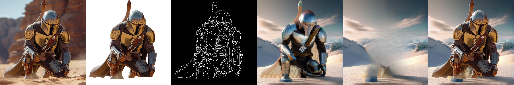

## Background Inpainting
This project utilizes Stable Diffusion XL, ControlNet, IP-Adapter, Grounding DINO, SAM (Segment Anything), and LAMA Inpaint to achieve seamless background replacement while preserving the integrity of the original elements.

<div align="center">


</div>



Specifically, GroundingDINO is used to identify the object, which are then segmented with SAM. The background is inpainted using ControlNet and Stable Diffusion XL, with guidance from Canny edge detection and IP-Adapter, while the foreground is removed via LAMA inpainting. At last, the identified object are copied and pasted into the newly generated background.

## Installation

Before installing diffusers, make sure that `PyTorch` and `Accelerate` are already installed.
```bash
pip install diffusers["torch"] transformers
```

Install the SAM library and LAMA inpaint dependencies.
```bash
pip install -r requirements.txt
```

Install GroundingDINO from the git repository.
```bash
pip install git+https://github.com/IDEA-Research/GroundingDINO.git
```

You can download the pre-trained model weights from the following link.

- `GroundingDINO`: [Swin-T GroundingDINO model](https://github.com/IDEA-Research/GroundingDINO/releases/download/v0.1.0-alpha/groundingdino_swint_ogc.pth)
- `SAM`: [ViT-H SAM model](https://dl.fbaipublicfiles.com/segment_anything/sam_vit_h_4b8939.pth)
- `LAMA Inpaint`: [Big LAMA](https://drive.google.com/drive/folders/1ST0aRbDRZGli0r7OVVOQvXwtadMCuWXg?usp=sharing)


## Usage
Run the following command, and all generated images will be saved in the `output_dir`. The `extract_prompt` parameter refers to the elements you want to extract from the `input_img`.
```bash
python inference.py \
    --input_img ./assets/image.jpeg \
    --output_dir ./output \
    --extract_prompt "person" \
    --background_prompt "frozen landscape with a glacier in the background" \
    --negative_prompt "low quality, bad quality, sketches" \
    --ground_ckpt ./pretrained_models/groundingdino_swint_ogc.pth \
    --sam_ckpt ./pretrained_models/sam_vit_h_4b8939.pth \
    --lama_ckpt ./pretrained_models/big-lama \
    --ip_adapter_scale 0.4 \
    --controlnet_conditioning_scale 0.5
```

## Acknowledgement
This code is based on [Diffusers](https://huggingface.co/docs/diffusers/using-diffusers/controlnet#controlnet-with-stable-diffusion-xl), [IP-Adapter](https://github.com/tencent-ailab/IP-Adapter), [GroundingDINO](https://github.com/IDEA-Research/GroundingDINO), [SAM](https://github.com/facebookresearch/segment-anything), [Inpaint Anything](https://github.com/geekyutao/Inpaint-Anything).